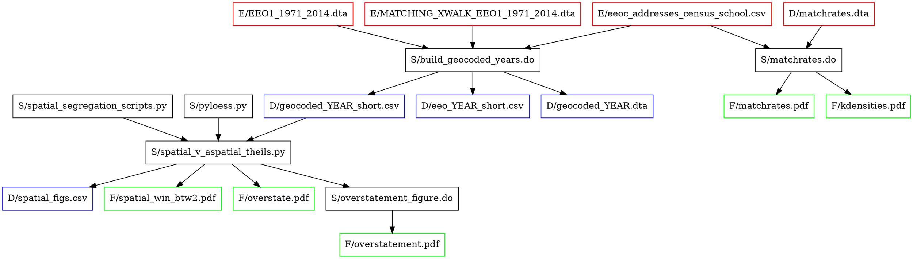

+++
date = '2020-04-29T11:43:39-05:00'
draft = false
title = 'Refactoring a project'
+++

# The trials of organization

Let's talk about replicable research. I think that it's important for other people to be able to reproduce your results, but the main reason I care about replicability is so I can reproduce *my own* results. I've found that I need to stop at certain points in a project and clean up, not just the code in files, but also the file structure itself. My rule is that the first time I have trouble remembering which file I'm supposed to be working on, it's time to clean up the project directory. Trust me: if you wait until the "end" of the project, it will be too late.

I use a standard directory structure for my research projects:

```
project_name
   |--canonical
   |--data
   |--documentation
   |--drafts
   |--figures
   |--literature
   |--presentations
   |--scripts
      |--old_code
   |--tables
```

A lot of people use something like this. `Canonical` holds original data and ideally is read-only except when explicitly adding new files. This is the stuff that, if I lost it, I'd be back to square one. `Data` holds any data *that I create*. I think the distinction is important. I never write output to `canonical` because it's just too easy to overwrite or erase things. If I've done things correctly, `data` could be erased and I could be up and running again in the time it takes to run my code. `Documentation` has how-tos of various sorts. These might be software manuals, dataset codebooks, methodological pieces, and the like. These are separate from `literature`, which has phenomenological pieces related to the project. Typically, if it will wind up in the lit review, it goes in `literature`; if it will wind up in a footnote or appendix, it goes in `documentation`. The distinction between these two directories is the least important.

I keep all of my code in a directory called `scripts`. That name probably says a lot about me. First, I started doing research before it became chic to talk about "code" and "coding" all the damned time. Second, I've spent too long in programs like Stata, and I maintain a mental distinction between "scripts," where I invoke existing commands, and "programming," where I write my own commands to give me functions beyond those built in. I realize this is a hoary and obsolete distinction. But let me have my old-coot-dom.

`Drafts` is where the paper drafts go. `Figures` and `tables` hold the obvious things. Note that TiKZ drawings live in `figures` both as TeX and as PDF documents. Finally, `presentations` has the inevitable PowerPoints. I maintain a separate directory for presentations because I often have ancillary graphical elements and perhaps custom-built figures for presentations, and it's easier to keep those in one place. LaTeX is fine with crawling across a directory structure for its needed elements, and there are traces in the files themselves of what resources are needed. Because PowerPoint embeds things, it's hard to reverse-engineer where the elements in a presentation came from.

Other people use other structures, but almost all productive people have some structure. The advantage of using the same skeleton across all projects is that you don't have to spend mental energy remembering where you put things on *this* one.

This skeleton also implies a rough workflow. Write scripts that read from `canonical` and write to `data`. Write other scripts that read from `data` and write to `figures` and `tables`. Reference those outputs in a document that lives in `drafts`. Store the scripts in `scripts`. Rinse; repeat.

In practice, it can be hard to follow this. Even if you save files in the right places, you can go down blind alleys and have to restart. But what do you do with that old code? Maybe you write a temporary file at some point because the code has grown too complex, or because some programming step takes a long time to run. Do you keep that file in the workflow, or do you refactor things to make it unnecessary? This is where the next step comes in.

# Projects as directed graphs

When I can no longer easily remember how the files of one of my projects fit together, I map dependencies. If I already have a draft paper, that's a good place to start. What files does it call? What files generate those files? What files generate *those* files? And so on, back to the canonical data. I mark up these connections freehand, in a notebook or in a text editor. Then--and this is probably where I reveal myself to be an obsessive--I write it up formally in the `dot` language, as a directed graph. I do this because I can then visualize the dependencies, which helps me immensely.

One of my running projects is on spatial metrics of employment segregation. I hit the wall last night, so today the directed graph came out. That produced the following code:


Don't get hung up in the code. Consider the output:


Red boxes are canonical data, things that are not generated by any of my code. Black boxes are scripts. Blue boxes are generated data, while green boxes are figures. The capital letters stand for `scripts`, `data`, `figures`, and `elsewhere`. (The latter would normally be `canonical`, but in this case the original data lives in a protected directory separate from the project itself.)

This *mostly* follows that workflow I mentioned, but there are weird exceptions. The script `build_geocoded_years.do` writes a couple of data files that aren't used by anything downstream; so does `spatial_v_aspatial_theils.py`. There are two figures, `overstate.pdf` and `overstatement.pdf`, that look suspiciously similar. At first I thought I'd just typed something wrong, but no, they're both in `figures`. The biggest problem though is in the upper right. The file `matchrates.dta` lives in `data`, yet there is nothing that generates it! It's an orphan, and yet a script then calls it to create two figures that are in the paper. This is a problem. Without that file, or at least a record of where it came from, you cannot replicate these results from the original data sources.

Orphan and widow files like these jump out when you code up a directory this way. So to do those bugbears of reproducible research, the circular dependencies. Now I can clean them up:

- The extra data files written by `build_geocoded_years.do` are intermediate files in route to `geocoded_YEAR_short.csv`. (There are actually 41 such files; the YEAR in caps is my way of noting a variable in a loop.) Intermediate files are especially common in Stata, where before version 16 you could only hold one dataset in memory at a time. It's just important to include the relevant `erase` commands at the end of that script to get rid of them.
- The `spatial_figs.csv` and `overstatement_figure.do` that come out of `spatial_v_aspatial_theils.py` are there because of one another. When I was first trying to plot the overstatement of aspatial (vs. spatial) employment segregation, and how to fit a locally weighted regression line through the points, I wrote a quick-and-dirty Stata script to do it. That script needed the data, so I had the python script write a CSV file that Stata could read. Later, I figured out how to plot this graphic directly in python (that's why the script calls `pyloess.py`). Thus all of these excess files can be removed, and the script that produced them can be cleaned up.
- Some experimentation revealed that the data in `matchrates.dta` was probably produced at one stage in `build_geocoded_years.do`. I have *no memory whatsoever* of doing this, but there was a fragment of commented-out code in the latter file, so there you go. I altered that code to reliably generate the needed data, and moved the figure-plotting code from `matchrates.do` into `build_geocoded_years.do` itself. That eliminates the need for the intermediate data file and the subsequent script.


The new dependency structure appears above. The only deviation from that idealized workflow is where one python script calls others. But that's OK, since the scripts called just define functions used in the calling one.

These aren't gigantic changes, but that's kind of the point. If you stop and do this every now and then, before things get too convoluted, it isn't a big deal to tidy things up. If instead you wait until a deep clean is necessary--if you wait until you have to Marie Kondo your project directory--this can become a true nightmare. Lest I seem pretentious, let me end with a similar file map that I created while trying to clean up an earlier project, before stopping in despair:


Delay refactoring at your own risk!